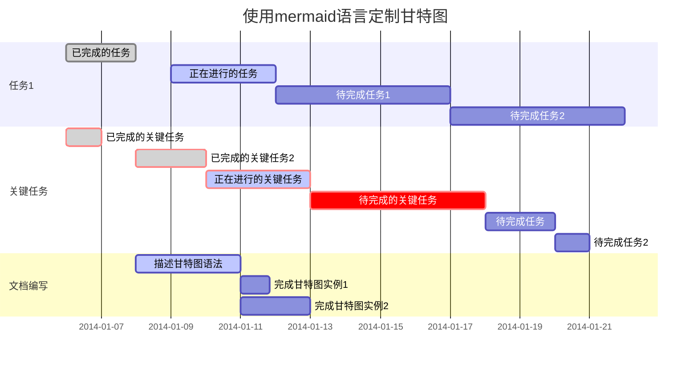

This is a custom summary and does *NOT* appear in the post.
<!--more-->



```mermaid
gantt         
    dateFormat  YYYY-MM-DD   
    title 使用mermaid语言定制甘特图

    section 任务1
    已完成的任务           :done,    des1, 2014-01-06,2014-01-08
    正在进行的任务               :active,  des2, 2014-01-09, 3d
    待完成任务1               :         des3, after des2, 5d
    待完成任务2              :         des4, after des3, 5d

    section 关键任务
    已完成的关键任务 :crit, done, 2014-01-06,24h
    已完成的关键任务2         :crit, done, after des1, 2d
    正在进行的关键任务             :crit, active, 3d
    待完成的关键任务        :crit, 5d
    待完成任务           :2d
    待完成任务2                      :1d

    section 文档编写
    描述甘特图语法               :active, a1, after des1, 3d
    完成甘特图实例1      :after a1  , 20h
    完成甘特图实例2    :doc1, after a1  , 48h
```
